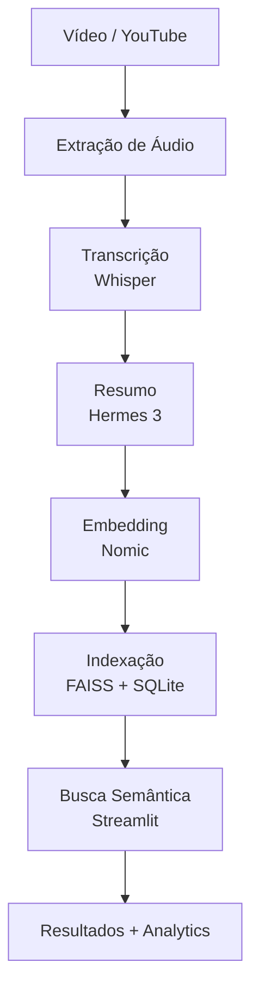

# 🎥 Edge Video RAG Agent >< Busca semântica local em vídeos

[](https://www.python.org/)
[](https://streamlit.io/)
[](https://github.com/openai/whisper)
[](https://lmstudio.ai/)
[](https://github.com/facebookresearch/faiss)
[](LICENSE)

> **Um motor de busca semântica para vídeos, rodando 100% local.**  
> Motor de busca semântica local para vídeos – pipeline RAG completo: extração de áudio (yt-dlp/ffmpeg),
> transcrição com Whisper, sumarização por Hermes 3 (LM Studio), embeddings Nomic, indexação vetorial FAISS + SQLite,
> e consulta por similaridade. Suporta YouTube, upload local e lotes. Inclui dashboard analítico com métricas de coleção,
> nuvem de palavras e gráficos interativos. Totalmente offline, privado e modular para extensão.

---

## 🧠 Arquitetura



## ✨ Funcionalidades

| Módulo | Descrição |
|--------|-----------|
| **Ingestão** | YouTube URL, lista de URLs (lote), upload de arquivo local (vídeo/áudio) |
| **Transcrição** | Whisper (OpenAI) – suporte multilíngue |
| **Sumarização** | Hermes 3 via LM Studio – resumo estruturado em português |
| **Embedding** | Nomic Embed (LM Studio) – 768 dimensões |
| **Armazenamento** | FAISS (índice vetorial) + SQLite (metadados) |
| **Busca** | Perguntas em linguagem natural, top_k resultados com score |
| **Analytics** | 12+ métricas, gráfico de barras interativo, nuvem de palavras, stopwords customizáveis |

## Stacks

| Camada | Tecnologia |
|--------|------------|
| **Backend** | Python 3.10+ |
| **UI** | Streamlit |
| **Áudio** | yt-dlp, ffmpeg, Whisper |
| **IA Local** | LM Studio (Hermes 3, Nomic Embed) |
| **Busca Vetorial** | FAISS, SQLite |
| **Visualização** | Plotly, Matplotlib, WordCloud |

## Aplicações Técnicas do Edge Video RAG Agent

O pipeline desenvolvido pode ser empregado em ambientes corporativos para análise de vídeos de treinamento, 
webinars e reuniões gravadas, transformando horas de conteúdo em uma base de conhecimento pesquisável semanticamente. 
A natureza local e privada o torna ideal para setores regulados (saúde, finanças, jurídico), onde a confidencialidade dos dados é crítica, 
eliminando a dependência de APIs externas e garantindo rastreabilidade total das informações extraídas.

Na área educacional, o sistema permite a construção de acervos temáticos a partir de videoaulas, 
palestras e documentários, possibilitando que alunos e professores realizem consultas conceituais em linguagem natural. 
Para criadores de conteúdo e pesquisadores, a ferramenta viabiliza a curadoria automática de grandes volumes de material, 
extraindo resumos estruturados e facilitando a descoberta de insights sem a necessidade de assistir integralmente cada vídeo. 

A arquitetura modular ainda possibilita a extensão para outros domínios, como podcasts, transmissões ao vivo e arquivos de áudio, 
consolidando-se como uma solução versátil para gestão de conhecimento multimídia.

## 🚀 Como Executar

### **1. Pré‑requisitos**

```bash
Python 3.10+

LM Studio com os modelos:

hermes-3-llama-3.2-3b (sumarização)

nomic-embed-text-v1.5 (embeddings)

Servidor ativo na porta 1234

ffmpeg no PATH (download)
```
### **2. Clone e configure**
```bash
git clone https://github.com/Gussnogue/edge-video-rag-agent.git
cd edge-video-rag-agent
python -m venv venv
source venv/bin/activate        # Linux/macOS
venv\Scripts\activate           # Windows
pip install -r requirements.txt
```
### **3. Execute**
```bash
streamlit run app.py
```

# 🧪 Como usar

--

### 📥 Ingestão (aba "Ingestão")

- YouTube URL: cole uma URL e clique em "Baixar, transcrever e indexar".

- Lista de URLs: cole uma lista (uma por linha) e use "Ingerir em lote".

- Upload local: carregue vídeo (MP4, AVI, MOV) ou áudio (MP3, WAV, M4A).

### 🔍 Consulta (aba "Consulta")

- Digite uma pergunta em linguagem natural (ex: "elefantes" ou "globalização"). - Conforme você vai alimentando seu acervo, faça novas buscas para teste.

- O sistema retorna os vídeos mais relevantes com resumo e link.

### 📊 Analytics (aba "Analytics")

- Veja estatísticas da coleção (total, palavras únicas, métricas temporais).

- Explore o gráfico de barras das palavras mais frequentes.

- Ajuste stopwords e veja a nuvem de palavras atualizar em tempo real.

# 📦 Estrutura do Projeto

```bash
video-rag-agent/
├── .env.example
├── .gitignore
├── requirements.txt
├── app.py                 # Interface Streamlit
├── config.py              # Configurações (LM Studio, diretórios)
├── downloader.py          # yt-dlp + ffmpeg
├── transcriber.py         # Whisper
├── summarizer.py          # Hermes 3
├── embedder.py            # Nomic Embed
├── vector_db.py           # FAISS + SQLite
├── test_insert.py         # Script de teste
└── data/                  # (criado localmente) áudios, banco, índice
```
# 🔧 Extensões Possíveis

- Suporte a podcasts (RSS) e outras plataformas.

- Integração com LLM para gerar respostas personalizadas (RAG + chat).

- Exportação de resumos em PDF/Markdown.

- Interface multi‑usuário (Streamlit Secrets).

# 📄 Licença

MIT License – livre para usar, modificar e compartilhar.
